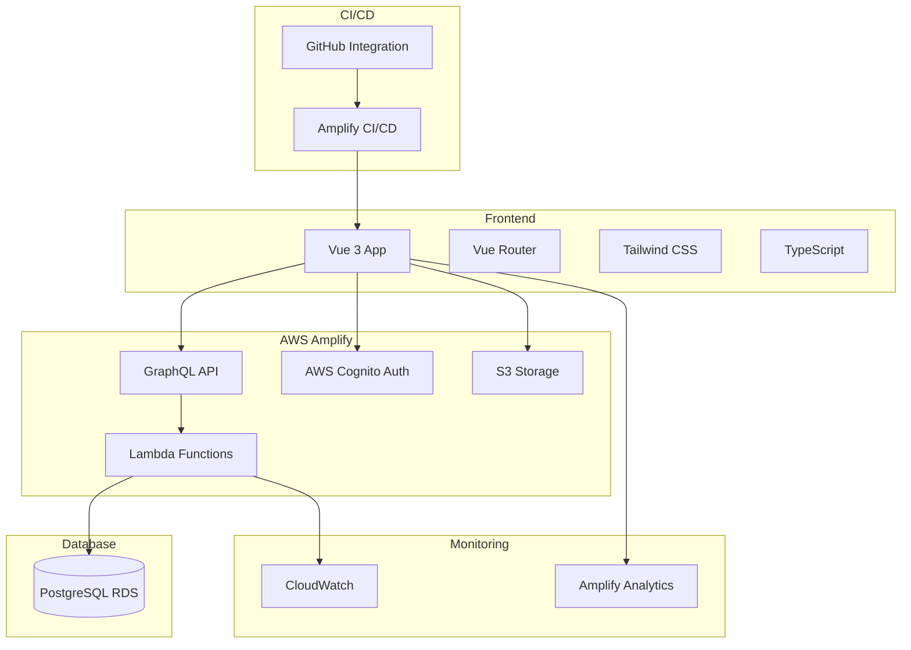

# DevOps Cloud Rendu

**Membre de l'équipe** : Lucas Charoing, Vincent Germe, Fanny Gautier

Application développée avec Vue 3, TypeScript, AWS Amplify et une architecture cloud moderne.


## 📋 Table des matières

- [Architecture](#-architecture)
- [Schéma des composants](#-schéma-des-composants)
- [Modèle de données](#-modèle-de-données)
- [Routes de l'application](#-routes-de-lapplication)
- [Stratégie de livraison](#-stratégie-de-livraison)
- [Scripts & Automatisation](#-scripts--automatisation)
- [Installation & Déploiement](#-installation--déploiement)

## 🏗 Architecture

### Stack Technologique
- **Frontend**: Vue 3 + TypeScript + Vite + Tailwind CSS
- **Backend**: AWS Amplify (GraphQL API)
- **Base de données**: PostgreSQL (via AWS RDS)
- **Authentification**: AWS Cognito
- **Stockage**: AWS S3
- **CI/CD**: AWS Amplify CI/CD
- **Tests**: Vitest + Playwright

## 🔄 Schéma des composants



## 📊 Modèle de données

### Schéma GraphQL (NoSQL avec relations)

```graphql
type User {
  id: ID!
  username: String!
  email: String!
  firstName: String
  lastName: String
  products: [Product] # Relation 1:N
  comments: [Comment] # Relation 1:N
  createdAt: AWSDateTime
  updatedAt: AWSDateTime
}

type Product {
  id: ID!
  title: String!
  description: String!
  imageUrl: String
  owner: User # Relation N:1
  ownerId: ID!
  comments: [Comment] # Relation 1:N
  createdAt: AWSDateTime
  updatedAt: AWSDateTime
}

type Comment {
  id: ID!
  content: String!
  product: Product # Relation N:1
  productId: ID!
  author: User # Relation N:1
  authorId: ID!
  createdAt: AWSDateTime
  updatedAt: AWSDateTime
}
```

### Autorisations et sécurité
- **User**: Propriétaire peut CRUD, autres utilisateurs peuvent lire
- **Product**: Seuls les Admins peuvent créer/modifier/supprimer, lecture pour tous
- **Comment**: Admins et Users peuvent créer, propriétaire peut CRUD, lecture pour tous

## 🛣 Routes de l'application

| Route | Composant | Auth Required | Description |
|-------|-----------|---------------|-------------|
| `/` | HelloWorld | ✅ | Page d'accueil avec statistiques |
| `/login` | Login | ❌ | Connexion utilisateur |
| `/signup` | Signup | ❌ | Inscription utilisateur |
| `/products` | ProductList | ✅ | Liste des produits |
| `/product/:id` | ProductDetail | ✅ | Détail d'un produit avec commentaires |
| `/create-product` | CreateProduct | ✅ | Création de produit (Admin uniquement) |
| `/profile` | Profile | ✅ | Profil utilisateur |
| `/roles-info` | RolesInfo | ✅ | Information sur les rôles |
| `/getUserCount` | Users Count | ✅ | Nombre total d'utilisateurs surl'application |
| `/getProductCount` | Products Count | ✅ | Nombre total de produits surl'application |

### Guards d'authentification
- Redirection automatique vers `/login` si non authentifié
- Vérification des permissions basée sur les groupes Cognito

## 🚀 Stratégie de livraison

### Description des environnements

#### **Staging (staging)**
- **URL**: `https://staging.d1234567890.amplifyapp.com`
- **Base de données**: PostgreSQL RDS (instance t3.small)
- **Authentification**: Pool Cognito dédié
- **Storage**: Bucket S3 dédié
- **Déploiement**: Automatique sur push vers `staging`

#### **Production (prod)**
- **URL**: `https://prod.d1234567890.amplifyapp.com`
- **Base de données**: PostgreSQL RDS (instance t3.medium avec backup)
- **Authentification**: Pool Cognito dédié
- **Storage**: Bucket S3 avec versioning
- **Déploiement**: Manuel après validation staging

### Exemple de User Stories

#### **US001: Inscription utilisateur**
```
En tant que visiteur,
Je veux pouvoir créer un compte,
Afin d'accéder aux fonctionnalités de l'application.

Critères d'acceptation:
- Formulaire avec email, username, mot de passe
- Validation des champs côté client et serveur
- Confirmation par email
- Redirection vers la page de connexion
```

#### **US002: Création de produit (Admin)**
```
En tant qu'administrateur,
Je veux pouvoir créer un nouveau produit,
Afin d'enrichir le catalogue.

Critères d'acceptation:
- Formulaire avec titre, description, image
- Upload d'image vers S3
- Sauvegarde en base de données
- Notification de succès/erreur
```

#### **US003: Commentaire sur produit**
```
En tant qu'utilisateur connecté,
Je veux pouvoir commenter un produit,
Afin de partager mon avis.

Critères d'acceptation:
- Zone de texte pour le commentaire
- Affichage en temps réel
- Modération possible par l'admin
```

### Politique de branches Git

```
main
├── develop
│   ├── feature/user-authentication
│   ├── feature/product-management
│   └── feature/comment-system
```

#### **Convention de nommage**
- `main`: Production stable
- `develop`: Intégration continue
- `feature/[nom-fonctionnalité]`: Nouvelles fonctionnalités
- `fix/[description]`: Corrections urgentes

#### **Workflow Git**
1. `feature/*` → `develop` (PR + Code Review)
2. `develop` → `staging` (Déploiement automatique)
3. `staging` → `main` (Après validation QA)
4. `hotfix/*` → `main` + `develop` (Urgences)

## 🛠 Scripts & automatisation

### Scripts de déploiement (package.json)

```json
{
  "scripts": {
    "dev": "vite",
    "build": "vue-tsc -b && vite build",
    "preview": "vite preview",
    "test": "vitest",
    "test:ui": "vitest --ui",
    "test:run": "vitest run",
    "test:coverage": "vitest run --coverage",
    "test:e2e": "playwright test",
    "test:e2e:ui": "playwright test --ui",
    "test:e2e:headed": "playwright test --headed",
    "test:all": "npm run test:run && npm run test:e2e",
    "amplify:push": "amplify push",
    "amplify:pull": "amplify pull",
    "amplify:deploy": "amplify publish"
  }
}
```

### Configuration des environnements

#### **Amplify CLI Configuration**
```bash
# Initialisation du projet
amplify init

# Configuration des environnements
amplify env add dev
amplify env add staging
amplify env add prod

# Déploiement par environnement
amplify push --env dev
amplify push --env staging
amplify push --env prod
```

#### **Variables d'environnement**
```typescript
// src/amplifyconfiguration.json (généré automatiquement)
{
  "aws_project_region": "eu-west-1",
  "aws_appsync_graphqlEndpoint": "https://[env-specific].appsync-api.eu-west-1.amazonaws.com/graphql",
  "aws_appsync_region": "eu-west-1",
  "aws_appsync_authenticationType": "AMAZON_COGNITO_USER_POOLS",
  "aws_cognito_region": "eu-west-1",
  "aws_user_pools_id": "[env-specific-pool-id]",
  "aws_user_pools_web_client_id": "[env-specific-client-id]"
}
```

### Provisionnement Cloud (AWS Amplify)

#### **Infrastructure as Code**
```yaml
# amplify/backend/api/devopscloudrendu/transform.conf.json
{
  "Version": 5,
  "ElasticsearchWarning": true,
  "ResolverConfig": {
    "project": {
      "ConflictHandler": "AUTOMERGE",
      "ConflictDetection": "VERSION"
    }
  }
}
```

#### **Lambda Functions**
```typescript
// amplify/backend/function/getUserCount/src/index.js
exports.handler = async (event) => {
  // Logique de comptage des utilisateurs
  return {
    statusCode: 200,
    headers: {
      "Access-Control-Allow-Origin": "*",
      "Access-Control-Allow-Headers": "*"
    },
    body: JSON.stringify({ count: userCount })
  };
};
```

#### **Pipeline CI/CD Amplify**
```yaml
# amplify.yml (configuration du build)
version: 1
backend:
  phases:
    preBuild:
      commands:
        - nvm install 22
        - nvm use 22
        - corepack enable
    build:
      commands:
        - amplifyPush --simple
frontend:
  phases:
    preBuild:
      commands:
        - nvm install 22
        - nvm use 22
        - corepack enable
        - pnpm install
    build:
      commands:
        - pnpm run test:run
        - pnpm run build
  artifacts:
    baseDirectory: dist
    files:
      - '**/*'
```

## 📦 Installation & Déploiement

### Prérequis
- Node.js 18+
- AWS CLI configuré
- Amplify CLI installé
- Git

### Installation locale
```bash
# Clone du repository
git clone [repository-url]
cd devops-cloud-rendu

# Installation des dépendances
npm install

# Configuration Amplify
amplify pull

# Démarrage en développement
npm run dev
```

### Déploiement
```bash
# Tests
npm run test:all

# Build de production
npm run build

# Déploiement
amplify publish
```

### Monitoring et Métriques
- **CloudWatch**: Logs et métriques Lambda
- **Amplify Analytics**: Métriques d'utilisation
- **RDS Performance Insights**: Performance base de données
- **S3 Access Logs**: Monitoring du stockage

---
